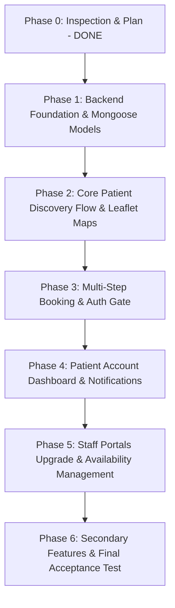

# TRANSFORMATION PLAN: Hospital Discovery + Management Platform (HMS-Rahul)

## Executive Summary
This document provides a comprehensive technical audit of the existing `HMS-Rahul` codebase and an actionable roadmap for transforming it into a full-fledged **Hospital Discovery & Management Platform**.

---

## 1. Package Configuration & Dependencies

### Current State
* **Root (`package.json`)**: Configured with npm workspaces (`frontend`, `backend`) and `concurrently` for running dev servers.
* **Frontend (`frontend/package.json`)**:
  * *Dependencies*: `react` (v19.2.0), `react-dom` (v19.2.0), `react-router-dom` (v7.13.0), `lucide-react` (v0.563.0), `jspdf` (v4.0.0), `jspdf-autotable` (v5.0.7).
  * *Missing for Discovery/Maps*: `leaflet` and `react-leaflet` (or `@types/leaflet` / `maplibre-gl`), `date-fns` or native date formatting utilities for slot computation.
* **Backend (`backend/package.json`)**:
  * *Dependencies*: `express` (v4.21.2), `cors` (v2.8.5), `dotenv` (v16.4.7), `morgan` (v1.10.0).
  * *Missing for Database & Auth*: `mongoose` (v8+), `jsonwebtoken`, `bcryptjs`.

### Planned Dependency Additions
* **Backend**: `npm install mongoose jsonwebtoken bcryptjs` (inside `backend/`).
* **Frontend**: `npm install leaflet react-leaflet` (inside `frontend/`).

---

## 2. Router Configuration & Routes Audit

### Current Routes in `frontend/src/app/router.jsx`
* `/` -> `PublicLayout` -> `Home.jsx`
* `/about` -> `About.jsx`
* `/feedback` -> `Feedback.jsx`
* `/patient` -> `PatientPortal.jsx` (currently acts as a static doctor listing)
* `/patient/form` -> `PatientForm.jsx` (single static registration form)
* `/login` -> `Login.jsx`
* `/unauthorized` -> `Unauthorized.jsx`
* `/portal/*` -> Protected role portals: `/portal/admin`, `/portal/doctor`, `/portal/receptionist`, `/portal/pharmacy`, `/portal/staff`

### Target Route Architecture for Hospital Discovery + Management
* **Public Discovery**:
  * `/` -> Redesigned discovery homepage (Location search, nearby hospitals, specialty shortcuts, how it works)
  * `/hospitals` -> Hospital explorer (interactive Leaflet map + search filters: specialty, distance, availability)
  * `/hospitals/:id` -> Hospital detail page (departments, doctors list, specialties, live OPD hours, location map)
  * `/doctors` -> Universal doctor directory with filter by hospital, specialty, availability
  * `/doctors/:id` -> Doctor profile with verified qualifications, hospital affiliations, real available slots
  * `/book/:hospitalId/:doctorId` -> Multi-step booking flow (Date/Time -> Auth gate -> Confirmation)
  * `/about` & `/feedback` -> Preserved
* **Auth**:
  * `/login` & `/register` -> Real JWT authentication for Patients & Staff
* **Patient Account**:
  * `/patient/dashboard` -> Active appointments, saved hospitals/doctors, notifications
  * `/patient/appointments` -> Upcoming / Completed / Cancelled tabs with real cancel/reschedule
  * `/patient/saved` -> Saved facilities and physicians
* **Staff & Admin Portals**:
  * `/portal/doctor` -> EMR, live queue, slot & leave management, appointment status actions
  * `/portal/receptionist` -> OPD token queue, check-in, manual booking, invoice creation
  * `/portal/pharmacy` -> Inventory & digital prescription dispensing
  * `/portal/staff` -> Shift tasks and duty management
  * `/portal/admin` -> Complete CRUD for Hospitals, Specialties, Doctors, Users, Logs, Invoices

---

## 3. AuthContext & Authentication System Audit

### Current State
* `frontend/src/context/AuthContext.jsx` issues a static mock token:
  ```javascript
  const token = "mock-jwt-token-12345";
  localStorage.setItem("hms_token", token);
  ```
* `frontend/src/services/auth.service.js` has a hardcoded `CREDENTIALS` dictionary (`DOC001`, `REC001`, `PHA001`, `STF001`, `ADM001`) that intercepts login when the backend is offline.
* The backend (`backend/src/controllers/auth.controller.js`) generates mock pseudo-tokens (`mock-token-${safeUser.id}-${Date.now()}`) without cryptographic signing or JWT verification.

### Phase 1 Remediation
1. Replace mock auth with **bcryptjs password hashing** and signed **JSON Web Tokens (JWT)** with role payloads (`patient`, `doctor`, `receptionist`, `pharmacy`, `staff`, `admin`).
2. Add `POST /api/auth/register` for patient onboarding and `POST /api/auth/login` returning signed JWT + user metadata.
3. Implement `authMiddleware.js` on the backend (`verifyToken`, `requireRoles(...)`).
4. Update `AuthContext.jsx` to store real JWT in localStorage, auto-verify token via `GET /api/auth/me`, and handle session expiration cleanly.

---

## 4. Existing Services & Backend State

### Current Backend State
* **No MongoDB Integration**: The backend currently relies on an in-memory JSON file store (`backend/src/data/store.js` + `db.json`).
* **Connection String**: `MONGODB_URI` is present in `backend/.env`, but no Mongoose connection or schemas exist.

### Planned MongoDB Schema Architecture (Phase 1)
1. **`Hospital`**:
   * `name`, `slug`, `tagline`, `description`, `address`, `city`, `state`, `pincode`, `contactPhone`, `emergencyPhone`, `email`, `website`, `location` (GeoJSON `Point` with `2dsphere` index: `[longitude, latitude]`), `departments` (Array), `specialties` (Array of ObjectId refs), `facilities` (Array), `workingHours` (Object), `isDemoData` (Boolean, default `true`).
2. **`Specialty`**:
   * `name`, `slug`, `icon`, `description`, `department`.
3. **`Doctor`**:
   * `name`, `hospital` (ObjectId ref), `specialty` (ObjectId ref), `qualifications`, `experienceYears`, `consultationFee`, `roomNumber`, `rating`, `reviewsCount`, `slotDurationMinutes` (default 30), `weeklySchedule` (Array of working days & time windows), `leaveDates` (Array of Dates), `isAvailableToday` (Boolean), `isDemoData` (Boolean).
4. **`Appointment`**:
   * `appointmentNumber` (Unique indexed string), `patient` (ObjectId ref to User), `doctor` (ObjectId ref), `hospital` (ObjectId ref), `specialty` (ObjectId ref), `date` (Date), `timeSlot` (String, e.g. "10:30 AM"), `status` (Enum: `BOOKED, CONFIRMED, COMPLETED, CANCELLED, NO_SHOW, RESCHEDULED`), `symptoms` (String), `notes` (String), `queueToken` (String).
   * **Compound Unique Index**: `[doctor, date, timeSlot]` where `status` is not `CANCELLED` to strictly prevent double-booking at the database level.
5. **`User` (Patient & Staff)**:
   * `name`, `email`, `passwordHash`, `role` (Enum: `patient, doctor, receptionist, pharmacy, staff, admin`), `phone`, `specialty` (for doctors), `hospital` (for staff/doctors), `savedHospitals` (Array of ObjectId refs), `savedDoctors` (Array of ObjectId refs), `notifications` (Array).

---

## 5. Existing Pages & Portals Audit

| Page / Portal | Current Status | Planned Upgrade |
|---|---|---|
| **Public Home (`Home.jsx`)** | Static demo cards and metrics | Real discovery hero, location search, live nearby hospitals preview, specialty shortcuts |
| **Patient Portal (`PatientPortal.jsx`)** | Hardcoded array of 6 doctors | Universal Doctor Directory connected to MongoDB with filters (Hospital, Specialty, Distance) |
| **Patient Form (`PatientForm.jsx`)** | Single static registration form | Multi-step interactive booking wizard (Date/Time Slot Picker -> Auth Gate -> Persisted DB Appointment) |
| **Hospitals Explorer (`/hospitals`)** | *Does not exist* | **[NEW]** Interactive Leaflet Map + searchable list with geospatial radius query |
| **Hospital Detail (`/hospitals/:id`)** | *Does not exist* | **[NEW]** Full profile with map, departments, verified doctor directory, and slot picker |
| **Doctor Profile (`/doctors/:id`)** | *Does not exist* | **[NEW]** Verified doctor profile with hospital affiliation, schedule, and direct booking |
| **Patient Dashboard (`/patient/dashboard`)** | *Does not exist* | **[NEW]** Patient portal showing live appointments, cancel/reschedule actions, saved favorites |
| **Doctor Portal (`DoctorPortal.jsx`)** | In-memory appointments tab | Live appointments from MongoDB, patient consultation queue, working hours/leave toggle |
| **Receptionist Portal (`ReceptionistPortal.jsx`)** | In-memory queue and appointments | Live OPD token queue, check-in actions, patient booking lookup, invoice generator |
| **Pharmacy Portal (`PharmacyPortal.jsx`)** | In-memory medicines list | Preserved and upgraded with MongoDB inventory collection & e-prescription dispensing |
| **Staff Portal (`StaffPortal.jsx`)** | In-memory tasks & schedule | Preserved and upgraded with MongoDB task tracking |
| **Admin Portal (`AdminPortal.jsx`)** | In-memory users and logs | Full management suite for Hospitals, Specialties, Doctors, and System Audits |

---

## 6. Component Audit (`components/home/` & UI components)

* **`HospitalMap.jsx`**: Currently a stub (`<div>Hospital Location Map Placeholder</div>`). Will be replaced with an interactive **Leaflet OpenStreetMap component** rendering real hospital markers, tooltips, popup cards, and user location pin.
* **`DoctorList.jsx` & `DoctorCard.jsx`**: Currently contain hardcoded dummy objects. Will be upgraded into reusable discovery components supporting pagination, loading skeletons, empty states, and direct booking triggers.
* **`AppointmentForm.jsx`**: Currently a toy form with `alert()`. Will be replaced by a structured multi-step booking module with live slot calculations.
* **Common UI (`Navbar`, `Footer`, `Button`, `Modal`, `Loader`, `Skeleton`, `EmptyState`, `ProtectedRoute`)**: High quality, 100% reusable across the new discovery pages.

---

## 7. Mocked & Hardcoded Data Inventory

1. **`frontend/src/services/auth.service.js`**: `CREDENTIALS` dictionary containing static passwords. *(To be removed in Phase 1)*
2. **`frontend/src/pages/portals/PatientPortal.jsx`**: `SPECIALISTS` array with 6 static doctors. *(To be replaced in Phase 2 with API query)*
3. **`backend/src/data/initialData.js`**: Static JSON with fake doctors, users, and appointments. *(To be replaced by Mongoose demo seeder with explicit `DEMO DATA` tags)*
4. **`frontend/src/context/` files**: `initialUsers`, `initialAppointments`, `initialInventory`, `initialTasks`. *(To be connected to live Mongoose models)*

---

## 8. Order of Execution (Phases 1–6)



### Next Steps
1. Upon your approval, begin **Phase 1 (Backend Foundation)**:
   - Install Mongoose, jsonwebtoken, bcryptjs.
   - Connect to MongoDB Atlas (`MONGODB_URI`).
   - Create Mongoose schemas: `Hospital`, `Doctor`, `Specialty`, `Appointment`, `User`.
   - Seed database with clearly labeled `DEMO DATA`.
   - Build REST APIs (`/api/hospitals/nearby`, `/api/doctors/availability`, `/api/auth/register`, `/api/appointments`).
   - Validate with end-to-end auth and geospatial test.
